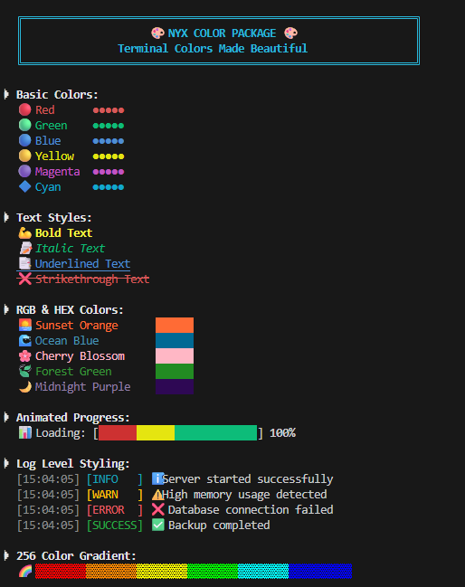

# 🎨 NYX Color

[](https://pkg.go.dev/github.com/nyxstack/color)
[](https://goreportcard.com/report/github.com/nyxstack/color)
[](https://opensource.org/licenses/MIT)

> A simple, zero-dependency ANSI color library for Go terminals.



This package helps you makes terminal output beautiful with support for 16/256/RGB colors, text styling, and background colors. Perfect for CLIs, logging systems, debugging tools, and any application that needs colorful terminal output.

## Installation

```bash
go get github.com/nyxstack/color
```


## ✨ Features

- 🌈 **Full Color Support**: Standard 16 colors, bright variants, 256-color palette, and 24-bit RGB
- 🎯 **HEX Colors**: Direct hex color support (`#FF0000`, `FF0000`)
- 🎨 **Text Styling**: Bold, italic, underline, strikethrough, dim, reverse, and more
- 🖼️ **Background Colors**: All color variants available as backgrounds
- ⚡ **Zero Dependencies**: Pure Go, no external dependencies
- 🚀 **High Performance**: Pre-computed ANSI codes, zero allocations
- 🛠️ **Easy to Use**: Simple string concatenation API

## 📦 Installation

```bash
go get github.com/nyxstack/color
```

## 🚀 Quick Start

```go
package main

import (
    "fmt"
    "github.com/nyxstack/color"
)

func main() {
    // Basic colors
    fmt.Println(color.Red + "Error: Something went wrong!" + color.Reset)
    fmt.Println(color.Green + "Success: Operation completed!" + color.Reset)
    
    // Styled text
    fmt.Println(color.Bold + color.Blue + "Important Information" + color.Reset)
    
    // Background colors
    fmt.Println(color.BgYellow + color.Black + " WARNING " + color.Reset)
    
    // RGB colors
    fmt.Println(color.RGB(255, 165, 0) + "Custom orange text" + color.Reset)
    
    // HEX colors
    fmt.Println(color.Hex("#FF69B4") + "Hot pink text" + color.Reset)
}
```

## 📚 Documentation

### Standard Colors

```go
// Basic colors
color.Black, color.Red, color.Green, color.Yellow
color.Blue, color.Magenta, color.Cyan, color.White

// Bright variants
color.BrightBlack, color.BrightRed, color.BrightGreen
color.BrightYellow, color.BrightBlue, color.BrightMagenta
color.BrightCyan, color.BrightWhite

// Always reset after coloring
fmt.Println(color.Red + "Red text" + color.Reset)
```

### Background Colors

```go
// Standard backgrounds
color.BgRed, color.BgGreen, color.BgBlue, color.BgYellow
color.BgMagenta, color.BgCyan, color.BgWhite, color.BgBlack

// Bright backgrounds
color.BgBrightRed, color.BgBrightGreen, color.BgBrightBlue
// ... and more

// Example usage
fmt.Println(color.BgRed + color.White + " Error " + color.Reset)
```

### Text Styling

```go
// Available styles
color.Bold         // Bold text
color.Dim          // Dimmed text
color.Italic       // Italic text
color.Underline    // Underlined text
color.Blink        // Blinking text
color.Reverse      // Reverse video
color.Hidden       // Hidden text
color.Strikethrough // Strikethrough text

// Combine styles
fmt.Println(color.Bold + color.Underline + color.Red + "Important!" + color.Reset)
```

### 256-Color Mode

```go
// Use any of the 256 ANSI colors
fmt.Println(color.Color256(196) + "Bright red" + color.Reset)      // Color 196
fmt.Println(color.Color256(46) + "Bright green" + color.Reset)     // Color 46
fmt.Println(color.Color256(21) + "Bright blue" + color.Reset)      // Color 21

// Color ranges:
// 0-15:   Standard colors
// 16-231: 6×6×6 color cube
// 232-255: Grayscale
```

### RGB Colors (24-bit)

```go
// True color support with RGB values (0-255)
fmt.Println(color.RGB(255, 99, 71) + "Tomato color" + color.Reset)
fmt.Println(color.RGB(64, 224, 208) + "Turquoise" + color.Reset)
fmt.Println(color.RGB(255, 215, 0) + "Gold" + color.Reset)
```

### HEX Colors

```go
// Support for hex colors with or without #
fmt.Println(color.Hex("#FF6B6B") + "Coral red" + color.Reset)
fmt.Println(color.Hex("4ECDC4") + "Mint green" + color.Reset)
fmt.Println(color.Hex("#FFE66D") + "Sunny yellow" + color.Reset)
```

## 💡 Examples

### Simple Logger

```go
package main

import (
    "fmt"
    "time"
    "github.com/nyxstack/color"
)

func logInfo(msg string) {
    timestamp := time.Now().Format("15:04:05")
    fmt.Printf("%s[%s]%s %s[INFO]%s %s\n", 
        color.Dim, timestamp, color.Reset,
        color.Blue, color.Reset, msg)
}

func logError(msg string) {
    timestamp := time.Now().Format("15:04:05")
    fmt.Printf("%s[%s]%s %s[ERROR]%s %s\n", 
        color.Dim, timestamp, color.Reset,
        color.Red, color.Reset, msg)
}

func main() {
    logInfo("Server started successfully")
    logError("Database connection failed")
}
```

### Progress Bar

```go
func showProgress() {
    fmt.Print("Progress: [")
    for i := 0; i < 50; i++ {
        if i < 25 {
            fmt.Print(color.Green + "█" + color.Reset)
        } else {
            fmt.Print(color.Dim + "░" + color.Reset)
        }
    }
    fmt.Println("] 50%")
}
```

### Color Palette

```go
func showPalette() {
    colors := []string{"#FF6B6B", "#4ECDC4", "#45B7D1", "#96CEB4", "#FFEAA7", "#DDA0DD"}
    names := []string{"Coral", "Mint", "Sky", "Sage", "Cream", "Plum"}
    
    for i, hex := range colors {
        fmt.Printf("%s%-10s%s %s██████%s\n", 
            color.Bold, names[i], color.Reset,
            color.Hex(hex), color.Reset)
    }
}
```

## 🧪 Running Examples

The package includes several example files:

```bash
# Basic usage examples
go run examples/basic.go

# 256-color demonstrations
go run examples/color_256.go

# Advanced RGB/HEX features
go run examples/advanced.go

# Demo for screenshots
go run examples/demo.go
```

## 🎯 Use Cases

- **CLI Applications**: Colorful command-line interfaces
- **Logging Systems**: Color-coded log levels and categories
- **Debug Output**: Highlight important information
- **Data Visualization**: Terminal-based charts and graphs
- **Status Indicators**: Progress bars, success/error states
- **Development Tools**: Enhanced terminal output for dev tools

## 🚀 Performance

NYX Color is designed for performance:
- Pre-computed ANSI escape sequences
- Zero memory allocations during normal usage
- No reflection or complex parsing
- Direct string concatenation
- Minimal overhead

## 🤝 Contributing

Contributions are welcome! Please feel free to submit a Pull Request. For major changes, please open an issue first to discuss what you would like to change.

## 📄 License

This project is licensed under the MIT License - see the [LICENSE](LICENSE) file for details.

## 🙏 Acknowledgments

- Inspired by the need for a simple, fast color library
- Thanks to the Go community for feedback and suggestions
- ANSI escape sequence standards

---

<div align="center">
Made with ❤️ by <a href="https://github.com/nyxstack">NYX Stack</a>
</div>
